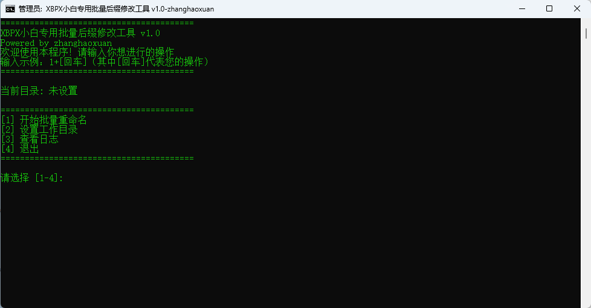

# :memo: 小白专用批量后缀修改工具

极简、稳定、无广告的文件后缀批量修改工具。专为小白用户设计，一键重命名，自动记忆路径，完美解决空格路径与编码问题。

## ✨ 特性

🚀 一键操作：交互式菜单，无需复杂命令。

💾 记忆功能：自动保存上次使用的文件夹，重启无需重新选择。

🛡️ 安全稳定：内置驱动修复机制，完美处理路径空格、特殊字符及幽灵编码问题。

🐞 日志系统：自带调试日志，出问题一目了然。

🌏 深度兼容：已通过 Windows 11 IoT LTSC (嵌入式极简版) 及 Windows 11 25H2 严苛测试。

🚪 自动提权：自动请求管理员权限 (UAC)，确保系统级目录操作无忧。

## 🚀 快速开始
 **1. 下载** 

下载项目中右侧版本下的文件列表。

 **2. 运行** 

方法 A (推荐)：直接双击bat文件，在弹出的 UAC 窗口（蓝色盾牌）中点击 “是”。

方法 B：右键点击文件，选择 “以管理员身份运行”。

 **3. 使用** 

选择 [2] 设置工作目录，输入您想修改文件的文件夹路径（支持含空格路径）。

选择 [1] 开始批量重命名，输入新的后缀名（如 txt）。

输入 Y 确认，即可一键完成！

## 📸 软件页面

## 🔧 常见问题 (FAQ)

Q: 为什么运行时需要管理员权限？

A: 为了保证能修改 Program Files 等受系统保护的目录，程序默认以管理员模式运行。代码内置了自动提权逻辑。

Q: 支持修改文件夹里的子文件夹吗？

A: 当前版本仅修改目标文件夹下的直接文件，不递归子文件夹。

Q: 遇到“路径无效”或“配置文件异常”怎么办？

A: 工具内置了“驱动修复”机制，会自动处理配置文件中的乱码或不可见字符。如仍需手动干预，可查看程序同目录下的 debug_log.txt。

Q: 为什么我的版本号是 v1.0，但开发代号是 v2.3？

A: v2.3 是我们在开发迭代中经过 Windows 11 IoT LTSC 等复杂环境测试通过的稳定版本，v1.0 是面向公众发布的首发正式版。

## 🛠️ 技术栈

语言：WIndows Shell
原生支持WIndows

## 🤝 贡献
欢迎提交 Issue 和 Pull Request！

## 📜 开源协议
 **MIT License** 

## 👨‍💻 作者
 **Powered by zhanghaoxuan** 

